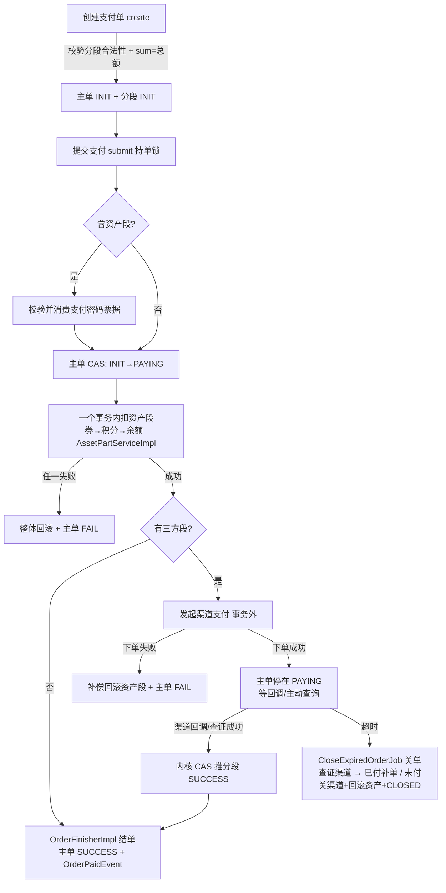
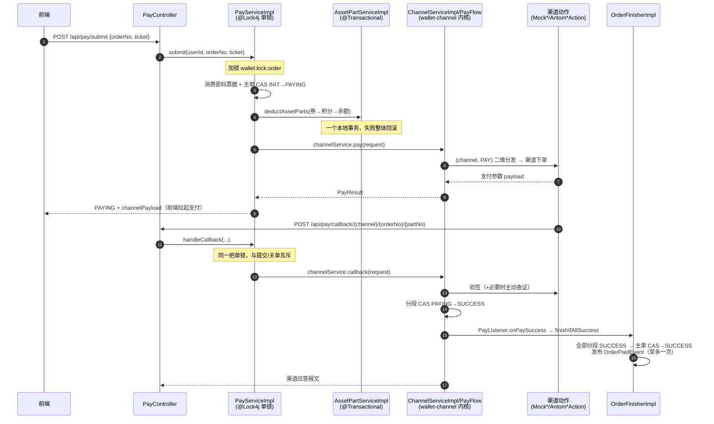
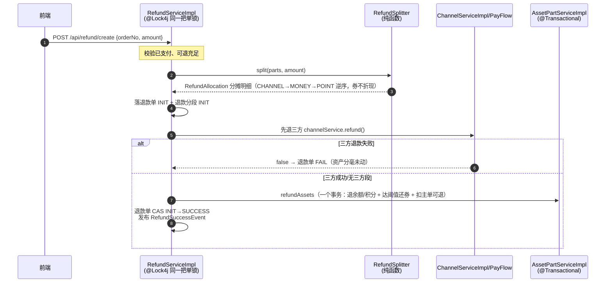
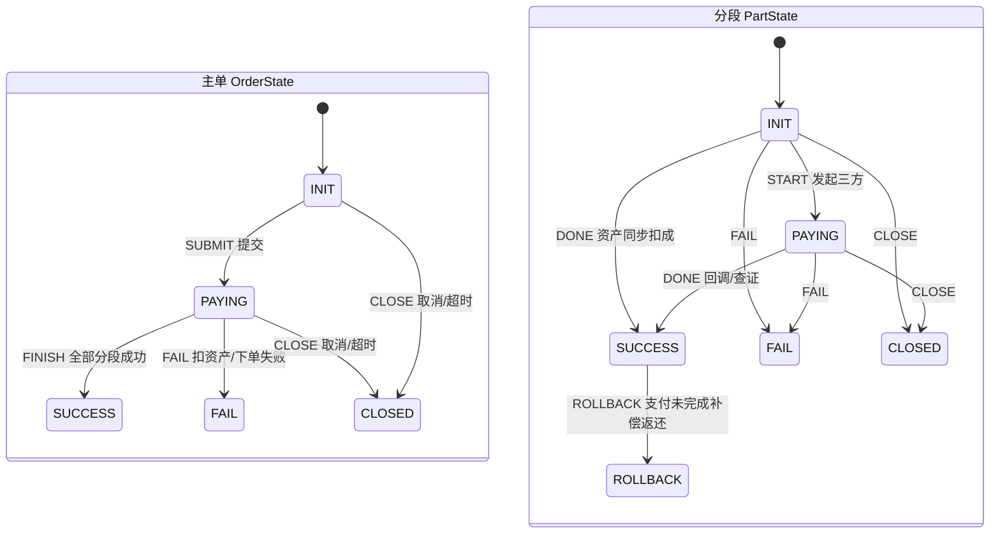
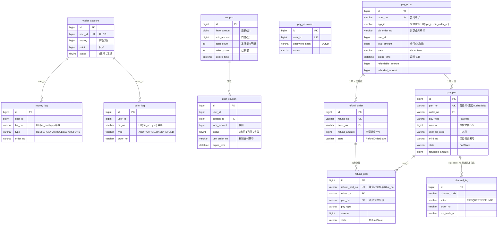

# wallet 钱包工程

多模块 Spring Boot 钱包：**用户账户**（余额 / 积分 / 优惠券 / 支付密码）+ **三方支付内核** + **拆分支付编排**。
由 pay-channel-sdk 扩展而来，两条主线设计贯穿全局：

1. **同一支付单的所有状态变更共用同一把分布式锁**；
2. **契约驱动的模块化**——跨模块调用只依赖 `wallet-contract` 的 `*Service` 接口与 DTO，
   实现（`*ServiceImpl`）在各自模块，持久化实体绝不跨模块（模块边界处做 entity→DTO 转换）。

- [技术栈](#技术栈)
- [工程结构](#工程结构)
- [快速开始（如何跑起来）](#快速开始如何跑起来)
- [配置说明](#配置说明)
- [核心设计](#核心设计)
- [REST 接口](#rest-接口)
- [开发约定](#开发约定)
- [测试](#测试)
- [监控](#监控)
- [接入真实支付渠道](#接入真实支付渠道)

## 技术栈

| 类别 | 选型 | 说明 |
|---|---|---|
| 语言/构建 | Java 21 LTS · Maven 3.9+ | 编译 release 21 |
| 框架 | Spring Boot 3.5.x · Spring Cloud 2025.0.x | Cloud 仅预置 BOM，组件按需引入 |
| ORM | MyBatis-Plus 3.5.x | 库模块只依赖 `mybatis-plus-core`，starter 与分页插件在 wallet-app；**Mapper 全部 default + LambdaWrapper，零手写 SQL**；实体继承 `BaseEntity`（审计字段自动填充 + `@TableLogic` 逻辑删除） |
| Redis | `spring-boot-starter-data-redis`（排除 Lettuce）+ Redisson 4.7 | `RedissonConnectionFactory` 桥接 Spring Data Redis；Redisson codec 用 `JsonJacksonCodec`，`RedisTemplate` 值用 Jackson JSON |
| 分布式锁 | lock4j 2.2.7 | `@Lock4j` 声明式，底层 Redisson 可重入锁；注解在 common（lock4j-core），装配在 app（starter） |
| 定时任务 | XXL-Job 3.4.2 | 执行器内嵌 wallet-app，需另行部署 xxl-job-admin |
| 数据库 | MySQL 8.0+ | 金额一律 BIGINT 分；状态存枚举 name() |
| 时区 | **系统时间统一 UTC** | JVM 默认时区 / Jackson / JDBC `serverTimezone` 全部 UTC，入库时间为 0 时区，客户端按自己时区转换展示 |
| 接口文档 | springdoc-openapi 2.8（Swagger 3 / OpenAPI 3） | `/swagger-ui.html` |
| 参数校验 | spring-boot-starter-validation | `@Valid` + 全局异常映射 |
| 限流 | Redisson 分布式固定窗口 | 四维：GLOBAL 应用兜底/API 接口/IP/USER；配置全局默认 + `@RateLimit` 注解接口覆盖，超限 429 |
| 渠道配置 | channel_config 表 | 商户密钥落库改库即生效（缓存 30s），不写 yml |
| 监控 | Actuator + Micrometer Prometheus | 独立管理端口 9080：`:9080/actuator/health`、`:9080/actuator/prometheus` |
| 测试 | JUnit 5 · Mockito · Testcontainers | Testcontainers 无 Docker 自动跳过 |
| 规划内 | RabbitMQ 3.13+ · Elasticsearch 8.x | 按需引入，尚未添加依赖 |

## 工程结构

六个模块，三层分工：**common 装类型（基建/枚举/实体基类）· contract 装契约（接口/DTO/扩展点）·
各领域模块装实现（serviceImpl 按功能分文件夹）**，app 是组合根。

```
wallet（父 pom：版本管理、模块聚合）
│
├── wallet-common    纯基建层（所有模块依赖）
│   ├── result/       ApiResult 统一返回体（含 traceId）
│   ├── error/        ErrorCode 全量错误码枚举（通用/账户/支付/渠道，code 全局唯一）+ CommonException
│   ├── entity/       BaseEntity 实体基类：createTime/updateTime（UTC 自动填充）、
│   │                 deleted（@TableLogic 逻辑删除）、createBy/updateBy
│   ├── enums/        全部业务枚举（12 个）：PayType/CouponType/OrderState/PartState/RefundOrderState/
│   │                 PayState/RefundState/ActionType + 状态机事件（OrderEvent/PartEvent/PayEvent/RefundEvent）
│   ├── rule/         通用规则引擎骨架：Rule<F,R> + RulePipeline
│   ├── trace/        TraceIds 链路追踪工具
│   └── util/         IdMaker 单号生成 / MoneyUtil 金额工具
│
├── wallet-contract  跨模块服务契约（依赖 common）：*Service 接口 + 跨模块 DTO + 扩展点，无业务实现
│   ├── account/      MoneyService/PointService/CouponService/AccountService/PasswordService
│   │   └── model/    CouponView / AccountSummary
│   ├── channel/      ChannelService（内核操作）/ ChannelConfigService（配置扩展点）
│   │   ├── action/   渠道动作扩展点：Channel 根接口 + Pay/Query/Refund/Cancel/Callback/Confirm
│   │   ├── spi/      宿主扩展点：TradeStore/RefundStore/PayListener/CallLogWriter/FeeRule
│   │   ├── model/    PayRequest/PayResult/CallbackRequest… 15 个
│   │   ├── state/    StateMachine 转换表状态机契约
│   │   └── error/    ChannelException（复用 common 的 ErrorCode）
│   └── pay/          PayService/RefundService/OrderFinisher/AssetPartService
│       └── model/    CreateOrderCmd/PartItem/结果/详情视图（PayOrderView 等）/
│                     RefundAllocation/RefundEntry… 13 个
│
├── wallet-channel   所有三方交互的归属地（依赖 contract）：支付内核 + 渠道动作实现
│   ├── core/         ChannelTable 渠道×动作二维注册表 / PayFlow 支付编排
│   ├── state/        PayStateMachine / RefundStateMachine
│   └── serviceImpl/  实现类（渠道动作按功能点聚合，Antom/Mock 同名动作放一起）
│       ├── support/   ChannelServiceImpl 内核组装门面（实现契约 ChannelService，app 装配）+
│       │              AntomClient 共享 SDK client / Abstract*Action / AntomConfig / AntomPayload /
│       │              MockStore / MockPayload / MockProperties
│       ├── pay/       AntomPayAction / MockPayAction
│       ├── query/     AntomQueryAction / MockQueryAction
│       ├── refund/    AntomRefundAction / MockRefundAction
│       ├── cancel/    AntomCancelAction / MockCancelAction
│       └── callback/  AntomCallbackAction / MockCallbackAction
│
├── wallet-account   用户账户（依赖 contract）：余额 / 积分 / 券 / 支付密码
│   ├── entity/       Account/MoneyLog/PointLog/Coupon/UserCoupon/PayPassword（继承 BaseEntity）
│   ├── mapper/       全部 CAS 条件更新 + 按业务号幂等流水
│   └── serviceImpl/  实现 contract.account 的 *Service 接口，按功能分文件夹
│       ├── money/       MoneyServiceImpl
│       ├── point/       PointServiceImpl
│       ├── coupon/      CouponServiceImpl + CouponRuleEngine/CouponFact + rule/ 券规则
│       ├── password/    PasswordServiceImpl + PasswordStore（BCrypt + 错误锁定 + 一次性票据）
│       └── account/     AccountServiceImpl 资产总览
│
├── wallet-pay       支付编排（依赖 contract；不依赖 account/channel 实现模块）
│   ├── entity/       PayOrder/PayPart/RefundOrder/RefundPart/ChannelLog/ChannelConfig（继承 BaseEntity）
│   ├── mapper/       CAS 状态推进 + 幂等
│   ├── serviceImpl/  实现 contract.pay 的接口，按功能分文件夹
│   │   ├── pay/          PayServiceImpl 支付编排
│   │   ├── refund/       RefundServiceImpl 退款 + RefundSplitter 分摊（纯函数）
│   │   ├── asset/        AssetPartServiceImpl 资产事务（扣减/回滚/退款）
│   │   ├── finisher/     OrderFinisherImpl 结单器
│   │   └── channelConfig/ ChannelConfigServiceImpl（channel_config 表 + 30s 缓存）
│   ├── adapter/      contract.channel.spi 的落库适配（TradeStore/RefundStore/PayListener/CallLogWriter）
│   ├── validate/     PayValidatorChain 责任链校验 + 6 个校验器
│   ├── state/        OrderStateMachine / PartStateMachine（转换表）
│   ├── event/        领域事件：OrderPaidEvent/OrderClosedEvent/RefundSuccessEvent + 审计订阅示例
│   ├── job/          CloseExpiredOrderJob 超时关单（XXL-Job）
│   └── mock/         MockNotifyService 自动回调（仅联调，宿主侧）
│
└── wallet-app       启动模块/组合根（依赖 pay、account、channel、contract）
    ├── controller/    REST 接口（入参 *Req + @Valid，跨模块调用只 import contract）
    ├── handler/       GlobalExceptionHandler 全局异常 → 统一返回体
    ├── filter/        TraceIdFilter 链路追踪
    ├── limit/         @RateLimit 四维限流
    ├── config/        AuditMetaObjectHandler（审计字段 UTC 自动填充）/ RedisConfig / MybatisPlusConfig /
    │                  JacksonConfig / WebConfig（跨域+限流）/ XxlJobConfig /
    │                  ChannelConfig（ChannelServiceImpl 装配：收集渠道动作 Bean + spi 落库适配）
    └── resources/     application.yml + config/*.yml + logback-spring.xml
```

依赖方向（编译期，全部单向无环）：

```
app → (pay, account, channel, contract)      组合根：装配全部实现 Bean
pay / account / channel → contract → common  库模块只声明 contract，common 经传递获得
```

- **跨模块调用只依赖 contract 的接口与 DTO**：pay 调账户能力经 `contract.account.*Service`，
  调渠道内核经 `contract.channel.ChannelService`；app 控制器只 import contract。
- **实体不跨模块**：entity 与 mapper/事务在各自模块内聚；数据跨模块边界一律走 DTO 视图
  （如 `PayOrderView`/`PayPartView`，state 用 String 承接，边界处 entity→DTO 转换）。
- 渠道实现的持久化/事件/日志经 `contract.channel.spi` 由 pay（宿主）提供；
  渠道配置经 `contract.channel.ChannelConfigService` 由 pay 读 channel_config 表供给。
- SQL 脚本统一放根目录 `sql/`，命名 `日期-中文说明.sql`。

依赖组织（pom 层面）：

- 版本统一在父 pom `dependencyManagement`（Boot BOM + Spring Cloud BOM + 自管三方件）。
- **横切依赖按"库提供类型、应用决定装配"分工**：
  - `wallet-common` 统一提供横切基建**类型/注解**（可能多模块用，库模块经传递获得，免重复声明）：
    `mybatis-plus-core` / `spring-context` / `spring-tx` / `spring-boot` / `jackson-databind` /
    `lock4j-core`（`@Lock4j`）/ `redisson`（分布式原语）/ `spring-boot-autoconfigure`（条件注解）/
    `spring-security-crypto`（BCrypt）/ `xxl-job-core`（`@XxlJob`）。
  - **boot starter（自动装配）一律只在 `wallet-app`**：`lock4j-redisson-spring-boot-starter`、
    `mybatis-plus-spring-boot3-starter`、`spring-boot-starter-*` 等。库模块引 starter 会把自动装配
    和一整串传递依赖塞给所有复用方，并可能触发意外装配。
  - **垂直三方业务 SDK 留在所属模块**：如 channel 的 Antom（支付宝国际）SDK。
- **lombok（provided）与 junit-jupiter（test）统一声明在父 pom 的 `<dependencies>`**：
  这两个作用域不具传递性、无法放进 common 让下游继承，而全模块都要用——由父 pom 声明、子模块继承。

## 快速开始（如何跑起来）

### 1. 前置依赖

- JDK 21（macOS：`brew install openjdk@21`）
- Maven 3.9+
- MySQL 8.0+（本机 127.0.0.1:3306，root 无密码；不同环境改 `config/infra.yml` 或用 `application-{env}.yml` 覆盖）
- Redis 7.x（本机 127.0.0.1:6379）
- 可选：xxl-job-admin（不部署则超时关单任务不跑，其余功能不受影响）

### 2. 初始化数据库

```bash
mysql -uroot -e "CREATE DATABASE IF NOT EXISTS wallet DEFAULT CHARSET utf8mb4"
mysql -uroot wallet < sql/2026-08-24-钱包建表.sql            # 含 BaseEntity 审计列（update_time/deleted/create_by/update_by）
mysql -uroot wallet < sql/2026-08-24-优惠券种子数据.sql      # 可选：两张联调用券模板
```

> 时间统一 UTC：应用侧已全部 UTC（JVM/Jackson/JDBC）；建议 MySQL 服务器时区也配置为
> UTC（my.cnf `default-time-zone='+00:00'`），让 DB 侧 `DEFAULT CURRENT_TIMESTAMP` 兜底值同样是 UTC。

### 3. 启动

```bash
# macOS 本机启动依赖服务（已在跑可跳过）
/opt/homebrew/opt/mysql/bin/mysql.server start
/opt/homebrew/opt/redis/bin/redis-server --daemonize yes

# 启动应用（默认端口 8080）
JAVA_HOME=$(/usr/libexec/java_home -v 21) mvn -pl wallet-app -am spring-boot:run
```

验证：`curl http://localhost:9080/actuator/health` 返回 `{"status":"UP"}`（actuator 走独立管理端口 9080）；
Swagger 文档：<http://localhost:8080/swagger-ui.html>。

### 4. 联调走一遍完整支付（mock 渠道）

用户识别用请求头 `X-Uid: <数字>`（联调用，无鉴权体系）。

```bash
UID='X-Uid: 1001'; CT='Content-Type: application/json'; H=http://localhost:8080

# ① 充值 100 元（金额单位一律"分"）
curl -s -H "$UID" -H "$CT" -d '{"amount":10000}' $H/api/asset/recharge

# ② 设置支付密码
curl -s -H "$UID" -H "$CT" -d '{"password":"123456"}' $H/api/password/set

# ③ 创建拆分支付单：余额 30 元 + mock 三方 20 元
curl -s -H "$UID" -H "$CT" -d '{
  "bizOrderNo":"BIZ-0001","totalAmount":5000,"currency":"CNY",
  "parts":[{"payType":"MONEY","amount":3000},
           {"payType":"CHANNEL","amount":2000,"channelCode":"MOCK"}]
}' $H/api/pay/create
# → data.orderNo，记为 P?????

# ④ 校验密码换一次性票据（绑定订单号与金额）
curl -s -H "$UID" -H "$CT" -d '{"password":"123456","orderNo":"P?????","amount":5000}' \
  $H/api/password/verify
# → data.ticket

# ⑤ 提交支付（扣余额段 + 发起 mock 三方；默认 5 秒后 mock 自动回调推成功）
curl -s -H "$UID" -H "$CT" -d '{"orderNo":"P?????","ticket":"<上一步的 ticket>"}' $H/api/pay/submit

# ⑥ 稍等几秒查单：主单 SUCCESS、两个分段 SUCCESS
curl -s -H "$UID" $H/api/pay/order/P?????

# ⑦ 退 10 元（按 CHANNEL→MONEY→POINT 逆序分摊）
curl -s -H "$UID" -H "$CT" -d '{"orderNo":"P?????","amount":1000,"reason":"测试退款"}' \
  $H/api/refund/create
```

所有响应都是统一返回体：`{code, message, data, traceId, timestamp, success}`；
拿着 `traceId` 可以在日志里串出这次请求的完整链路。返回的时间均为 UTC，客户端按自己时区转换展示。

### 5. 常用命令

```bash
JAVA_HOME=$(/usr/libexec/java_home -v 21) mvn test      # 全量构建+测试（密码单测需本机 Redis，不可用自动跳过）
JAVA_HOME=$(/usr/libexec/java_home -v 21) mvn compile   # 只编译
```

## 配置说明

配置按主题拆分（`spring.config.import` 装配）；**按主题拆文件、按环境拆 profile**，
环境差异写 `application-{env}.yml` 覆盖，不改主题文件。

```
resources/
├── application.yml      # 主入口：应用名、端口、import 清单
├── logback-spring.xml   # 日志：pattern 内嵌 traceId、按天/100MB 滚动留 30 天、ERROR 单独文件、异步输出
└── config/
    ├── infra.yml        # 基础能力：数据源(serverTimezone=UTC)/Redis/MyBatis-Plus/lock4j/XXL-Job/Web 时间格式/springdoc
    ├── biz.yml          # 业务参数：wallet.pay（超时/积分汇率）、wallet.password、wallet.antom
    ├── mock.yml         # Mock 渠道（仅联调）：wallet.mock.enabled=false 时 Mock*Action 全部不注册
    └── monitor.yml      # 监控端点暴露 + 日志级别
```

生产要点：`wallet.mock.enabled=false` 关闭 mock 渠道；`xxl.job.enabled=true` 并配好调度中心地址
（不开则超时关单不跑、PAYING 订单不会自动关闭/补单，启动时会打 WARN 提醒）；
CORS 白名单收紧（`WebConfig`）；actuator 已默认走独立管理端口 9080——对外网关/LB 只暴露 8080，
监控端点仅内网可达；数据源/Redis 地址与凭据用 prod profile 覆盖；接入真实用户体系替换 `X-Uid` 头。

## 核心设计

### 契约架构与数据边界

- **接口 = 契约**：所有 service 能力接口按 `*Service` 命名放 `wallet-contract`，实现按 `*ServiceImpl`
  命名放各模块 `serviceImpl/`（按功能分文件夹）。调用方注入接口，Spring 装配实现（app 组合根拉全 Bean）。
- **数据边界**：持久化实体只在本模块流转；跨模块传输一律用 contract 的 DTO
  （详情视图 `PayOrderView`/`PayPartView` 等，state 用 String 承接枚举），模块边界处显式转换。
  这保证任何模块改表结构不影响其他模块。
- **BaseEntity 审计**（common.entity）：所有实体继承——`createTime`/`updateTime` 由
  `AuditMetaObjectHandler` 以 **UTC** 自动填充（`@TableField(fill)`，业务代码禁止手动 set）；
  `deleted` 逻辑删除（`@TableLogic`：查询自动过滤已删、delete 语句自动改 update）；`createBy`/`updateBy` 预留。

### 业务全景（拆分支付流程图）



### 拆分支付
一笔支付单可同时用 **优惠券抵扣 + 积分 + 余额 + 三方渠道** 拆成多段：

- `pay_order` 主单记录总额与状态；`pay_part` 分段记录每段金额与来源（PayType：COUPON/POINT/MONEY/CHANNEL）。
- 校验 `sum(段金额) == 总金额` 通过后才能创建；一个支付单至多一个三方分段。
- 资产段（券/积分/余额）在**同一个本地事务**内按 券→积分→余额 顺序 CAS 扣减，任一段失败整体回滚
  （事务边界在独立 Bean `AssetPartServiceImpl`，经代理调用保证 @Transactional 生效；
  接口 `AssetPartService` 在 contract，签名全 DTO）；三方段异步等回调确认，期间主单停在 PAYING。
- 纯资产支付（无三方段）当场完成；渠道下单失败时已扣资产段自动补偿回滚。
- 结单（全部分段成功 → 主单 SUCCESS + 发布 OrderPaidEvent）唯一入口是 `OrderFinisher` 契约
  （实现 `OrderFinisherImpl`），纯资产完成、渠道回调、补单三条路径共用，事件至多发布一次（以 CAS 影响行数为准）。

### 支付时序（余额 + 三方渠道混合支付）



### 退款时序



### 同一把锁
分布式锁统一用 lock4j 注解声明：`@Lock4j(name = "order", keys = "#orderNo")`，
实际 key 为 `wallet:lock:order#{orderNo}`（前缀由 `lock4j.lock-key-prefix` 配置）。
提交支付、回调、主动查询、退款、取消、超时关单入口全部持同一把锁，串行执行。
底层是 Redisson 可重入锁（`RedissonLockExecutor` 复用手动装配的 `RedissonClient`）：
看门狗续期、等锁 3 秒快速失败（`LockFailureException` 由全局异常处理映射为 `LOCK_FAILED`）。
内核 `wallet-channel` 不加锁，由编排层入口方法持锁。
**注意 AOP 自调用不生效**：`@Lock4j`/`@Transactional` 方法必须经 Spring 代理（跨 Bean）调用。

### 状态机（转换表式，枚举落地）



- 退款单 `RefundOrderState`：`INIT --> REFUNDING（预留） --> SUCCESS / FAIL`

状态与事件枚举全部在 `common.enums`（DB 存 name()，服务层无字符串比较）；
`StateMachine` 契约在 contract，转换表实现在各域：支付/退款内核状态机在 channel/state，
订单/分段状态机在 pay/state；可否关单等转换判定走 `canTransition`，不写 if-else 链。

### 数据模型（ER 图）



- 图中省略了各表共有的审计列（BaseEntity）：`create_time`/`update_time`（UTC，应用自动填充）、
  `deleted`（逻辑删除）、`create_by`/`update_by`——已含在建表 SQL 中。
- 逻辑外键（无物理外键约束）：单号字符串关联，唯一索引保证幂等
  （`pay_order.order_no`、`pay_part.part_no`、`money_log/point_log (biz_no,type)` 等）。

### 并发与幂等（CAS + 幂等流水）
- 扣余额：`UPDATE wallet_account SET money = money - x WHERE user_id=? AND money >= x`（影响行数=1 才算成功）
- 核销券：仅当属于该用户、未使用、未过期时成功
- 状态推进：`UPDATE ... SET state=to WHERE 单号=? AND state=from`
- 建单幂等：`(app_id, biz_order_no)` 唯一索引，同接入方同业务单号重复创建返回既有支付单
  （金额不一致直接拒绝）；多商城接入时 app_id 即来源商城（当前默认 DEFAULT）
- 资产流水按 `biz_no + type` 唯一索引幂等（重复写入静默忽略）
- 以上全部用 MyBatis-Plus `LambdaUpdateWrapper` 表达（列运算用 `setSql("col = col - {0}", x)` 参数绑定）

### 崩溃恢复与最终一致

内核不开跨渠道调用的长事务（渠道 HTTP 不在任何事务内），一致性靠 **CAS + 补偿 + 超时关单查证** 收敛：

- 任何步骤间崩溃，订单都停留在可判定状态（INIT/PAYING + 分段状态组合）；
- `closeOrFinish`（取消/超时关单共用）**先尝试结单再考虑关闭**：分段已全部 SUCCESS（含"渠道款已实收
  但结单前崩溃"的窗口）一律补单完成，绝不回滚资产/关单——否则渠道款不退不入账，产生资损；
- 未支付的订单：查证渠道 → 关渠道交易 → 补偿返还资产段（幂等流水保证重放安全）→ 关单；
- 资金 CAS（扣可退、扣余额等）全部校验影响行数，失败即抛异常回滚所在事务。

### 责任链校验（支付域入口）

创建/提交/详情/查证/取消/退款入口的校验统一走 `PayValidatorChain`（`pay/validate/`）：
校验器实现 `PayValidator` 声明适用场景（PayScene）与顺序（归属 10 → 状态 20 → 明细/票据 30），
注册为 Bean 即自动入链；**新增校验 = 新增一个实现类，服务层零改动**。
现有节点：归属校验（全场景）、创建金额勾稽、分段规则（含券规则引擎）、提交终态拦截、
票据校验消费（链上唯一有副作用的节点，放最后）、退款金额校验。

### 通用规则引擎 + 券规则

`wallet-common` 提供通用抽象：`Rule<F, R>`（matches/apply/order）+ `RulePipeline`（排序执行、结果沿管道传递）。
各业务域定义自己的 fact 与规则子接口接入——**优惠券是第一个接入域**，后续营销活动等照此模式：

- 券域：`CouponFact`（券+订单额）→ `CouponDeductRule` → 管道：
  最低消费校验(10) → 满减/折扣计算(20) → 最高抵扣封顶(30) → 不超订单额且必须为正(40)；
- 券类型：`FULL_CUT` 满减（面额）、`DISCOUNT` 折扣（discount_rate，85=八五折），
  公共约束 min_amount（最低消费）与 max_deduct_amount（最高抵扣）；
- **新增券玩法 = 加枚举值 + 一个 @Component 规则实现**，引擎与下单校验零改动；
- 券段金额必须等于引擎计算的抵扣额（创建时责任链校验），退款侧"券不折现"逻辑不变。

### 领域事件
`OrderPaidEvent` / `OrderClosedEvent` / `RefundSuccessEvent` 在 CAS 推进成功处发布（至多一次）。
业务联动写 `@EventListener` 订阅（示例见 `DomainEventLogger`），服务间不互相调用。
事件在持锁内同步派发：监听器只做轻量动作，重活转 `@Async` 或消息队列。

### 支付密码
BCrypt 慢哈希（强度 12）+ 连续错 5 次 / 当日 10 次锁 10 分钟 +
校验通过签发一次性授权票据（Redis，TTL 300 秒），提交支付时原子消费并复核用户/订单/金额。

## REST 接口

默认端口 8080，用户识别用请求头 `X-Uid: <数字>`；在线文档 `/swagger-ui.html`。

| 方法+路径 | 说明 |
|---|---|
| GET `/api/asset/summary` | 资产总览（余额/积分/可用券） |
| POST `/api/asset/recharge` | 模拟充值余额 `{amount}` |
| POST `/api/asset/point/add` | 模拟发积分 `{count}` |
| POST `/api/asset/coupon/take` | 领券 `{couponId}` |
| POST `/api/password/set` | 设置/重置支付密码 `{password, oldPassword?}` |
| POST `/api/password/verify` | 校验密码签发票据 `{password, orderNo, amount}` |
| POST `/api/pay/create` | 创建拆分支付单 `{bizOrderNo, totalAmount, currency, parts[]}`（可带 `X-App-Id` 标识来源商城；同 app 同 bizOrderNo 幂等） |
| POST `/api/pay/submit` | 提交支付 `{orderNo, ticket?}`（含资产段必须带票据） |
| POST `/api/pay/callback/{channel}/{orderNo}/{partNo}` | 渠道异步回调（验签在渠道实现内） |
| GET `/api/pay/order/{orderNo}` | 查主单+分段（`OrderDetail` 视图） |
| POST `/api/pay/query/{orderNo}` | 主动向渠道查证 |
| POST `/api/pay/cancel/{orderNo}` | 取消支付（未付关单退资产；已付补单完成） |
| POST `/api/refund/create` | 发起退款 `{orderNo, amount, reason?}` |
| GET `/api/refund/{refundNo}` | 查退款单+分段（`RefundDetail` 视图） |

统一返回体：`{code, message, data, traceId, timestamp, success}`（`code="0"` 即成功）。
错误码统一在 `com.wallet.common.error.ErrorCode`（全量枚举：通用/账户/支付/渠道，code 全局唯一）；
参数校验失败统一 `BAD_PARAM`，锁冲突统一 `LOCK_FAILED`。

HTTP 状态码约定（影响调用方重试语义，尤其渠道回调）：
**业务失败 200**（code 区分，重试无意义）· **参数/报文错 400** · **锁冲突 429** · **系统异常 500**
——渠道对非 2xx 回调应答会重试，锁竞争/瞬时故障不丢通知。

## 开发约定

- **契约命名**：跨模块能力接口按 `*Service` 命名放 `wallet-contract`（跨模块 DTO 放对应域 `model/`）；
  实现类按 `*ServiceImpl` 命名放本模块 `serviceImpl/` 并按功能分文件夹。
  新增跨模块能力 = contract 定义接口 + 实现模块写 Impl，调用方只 import contract。
- **数据边界**：实体不出模块；跨模块数据一律 DTO（视图 record，state 用 String），边界处显式转换。
- **实体**：全部继承 `BaseEntity`（common.entity）；业务代码**禁止手动 set** createTime/updateTime
  （`AuditMetaObjectHandler` UTC 自动填充）；逻辑删除走 `@TableLogic`（deleted 列）。
  实体自有字段手写 getter/setter，跨模块 model 用 record。
- **时间**：**系统时间统一 UTC**——JVM 默认时区（WalletApp 启动设置）、Jackson、JDBC `serverTimezone`
  全部 UTC；客户端按自己时区转换展示；新代码 `LocalDateTime.now()` 天然产出 UTC，不要再指定时区。
- **错误码**：统一加在 `common.error.ErrorCode`（全量枚举），业务异常抛 `CommonException(error, detail)`，
  渠道内核抛 `ChannelException(error, detail)`；不再按模块建错误枚举。
- **日志**：统一 SLF4J（`@Slf4j`）；error 日志必须带异常堆栈（异常对象作最后一个参数）。
- **Lombok 使用范围**：`@Slf4j` + `@AllArgsConstructor`（Bean 依赖注入，构造器不手写）+
  `@Getter/@Setter`（BaseEntity、异常类）；构造器里有初始化逻辑或参数带 @Value 时保留手写。
- **Swagger（OpenAPI 3）**：控制器标 `@Tag`/`@Operation`/`@Parameter`，出入参与暴露 DTO 标 `@Schema`；
  文档信息在 `OpenApiConfig`，在线文档 `/swagger-ui.html`。
- **数据访问**：Mapper 全部 default 方法 + `LambdaQueryWrapper`/`LambdaUpdateWrapper`，不写注解/XML SQL；
  分页用 `PaginationInnerInterceptor`（已装配）。
- **序列化**：Jackson 全局配置（`JacksonConfig`）——`LocalDateTime ⇄ yyyy-MM-dd HH:mm:ss`、
  `LocalDate ⇄ yyyy-MM-dd`、`LocalTime ⇄ HH:mm:ss`、时区 UTC；枚举入参大小写不敏感；
  查询串/表单参数格式在 `spring.mvc.format`，与 JSON 一致。
- **入参**：HTTP 入参 DTO 放 wallet-app、后缀 `*Req`、加 jakarta 校验注解，`toCmd()` 转服务层命令对象；
  服务层入参后缀 `*Cmd`（在 contract 的 model）。
- **事务与锁**：`@Transactional`/`@Lock4j` 方法放独立 Bean 经代理调用，严禁类内 `this.` 自调用。
- **命名**：`@ConfigurationProperties` 类后缀 `*Properties`；XXL-Job 任务类放 `job/` 后缀 `*Job`；
  金额一律 long（分）。
- **限流**：全局默认在 `wallet.rate-limit.*`（GLOBAL 应用兜底/IP/USER），
  接口按维度收紧用 `@RateLimit(dim = ..., permits = ...)` 可重复注解（API 维度只能注解配）；
  敏感接口示例见 `PasswordController.verify`（防爆破）与 `PayController.submit`。
- **TraceId**：HTTP 由 `TraceIdFilter` 自动处理；异步/定时任务入口 `TraceIds.seed()` 播种、finally 里 `clear()`。

## 测试

```bash
JAVA_HOME=$(/usr/libexec/java_home -v 21) mvn test
```

- 单元测试：状态机、退款分摊（纯函数）、渠道内核编排（内存 SPI 实现）。
- 支付密码测试需本机 Redis，连不上自动跳过（assumeTrue）。
- 集成测试范式见 `TestcontainersSmokeTest`：起真实 MySQL 8 / Redis 7 容器，无 Docker 自动跳过。

## 监控

- actuator 走**独立管理端口 9080**（`management.server.port`），与业务端口 8080 隔离，
  对外只暴露 8080 时监控端点天然不可达。
- 健康检查：`GET :9080/actuator/health`
- Prometheus 抓取：`GET :9080/actuator/prometheus`（已打 `application=wallet` 标签）
  - JVM/CPU/GC：自动上报（`jvm_*`、`system_cpu_*`、`process_*`）
  - QPS/RT：`http_server_requests_seconds_count / _sum / _max`
- Grafana：导入 "JVM (Micrometer)" 4701 号面板 + 按 `http_server_requests_seconds` 建 QPS/RT 图。
- 定时任务：超时关单 `closeExpiredOrders`（建议 1 分钟一次）在 xxl-job-admin 创建执行器
  （appname=`wallet-executor`）与任务后生效。

## 接入真实支付渠道

渠道实现放 **`wallet-channel` 的 `serviceImpl/`**，按动作一类（参考 Antom 渠道示范）：

1. 在 `serviceImpl/support/` 建渠道支撑类：`<渠道>Client`（配置加载 + SDK client 缓存，注入契约
   `ChannelConfigService` 读 channel_config 表）+ `Abstract<渠道>Action`（渠道编码基类）。
2. 在 `serviceImpl/pay|query|refund|cancel|callback/` 下按动作各建一个 `@Component` 类，
   实现 `contract.channel.action` 的对应接口（`PayAction` 必选，其余按渠道能力选）。
3. Spring 自动收集所有 `Channel` Bean，`ChannelConfig`（app）装配进 `ChannelServiceImpl`，
   `ChannelTable` 按 **渠道×动作** 二维注册（构建期校验完整性：缺 PAY/重复注册启动即失败），
   `PayFlow` 按 `(channelCode, ActionType)` 分发。
4. 商户配置进 `channel_config` 表（建表 SQL 已含 Antom 模板行）：填 config_json 密钥、enabled 置 1
   即启用，改库 30 秒内生效无需重启；测试/生产切换改 config_json 里的 gateway（沙箱地址）即可。
